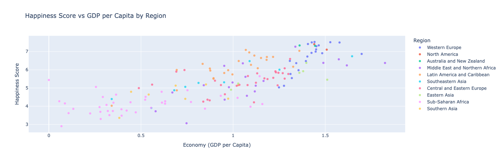
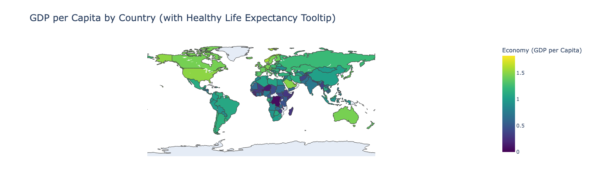

# World Happiness - Gen AI Project

## Into
This project analyses what are the main factors that influence happiness accros different countries and regions of the world.
For this project I used ChatGPT as my Gen AI tool to help me generate all python code used in this project. 
By giving the right commands, and making sure that the code snippets generated are correct for my use case, I was able to increase efficiency and complete the project within a couple of hours. 

## About the Data 
The dataset used in this project is the world happiness survey of 2016, from Kaggle :
https://www.kaggle.com/datasets/unsdsn/world-happiness?resource=download&select=2016.csv
this dataset is a clean CSV file, meaning no data cleaning was performed in this project. 

## Technologies used
- Jupyter Notebooks
- Python libraries; Pandas, Matplotlib, Seaborn, Plotly, and Dash
- ChatGPT

## Exploratory Data Analysis
In this project I wanted to find the main factors that influences happiness around the world. 
by compering different attributes and visualizng them I was able to find positive and negative patterns in the dataset.

### Correlation Heatmap
The correlation heatmap indicates that economic prosperity, strong family relationships, and longer healthy life expectancy are consistently associated with higher happiness scores.

### GDP per Capita vs Happiness
This scatter plot comparing GDP per capita and happiness across regions shows a strong upward trend: 
Wealthier regions tend to report greater life satisfaction. 
However, several countries stand out by achieving higher happiness levels than their GDP alone would predict—suggesting cultural, social, or governance-driven effects.

### Happiness by Region
The pie chart reveals regional disparities, with certain regions contributing disproportionately to higher happiness scores. 
This reinforces the understanding that global well-being is not evenly distributed.

### Global Happiness Map
Finally, the global map visually connects economic strength and public health outcomes. 
The happier the country, the brighter it'll be on the map. 
Countries with high GDP per capita also display higher healthy life expectancy in the tooltip data, reflecting the intertwined nature of economic and social development.

